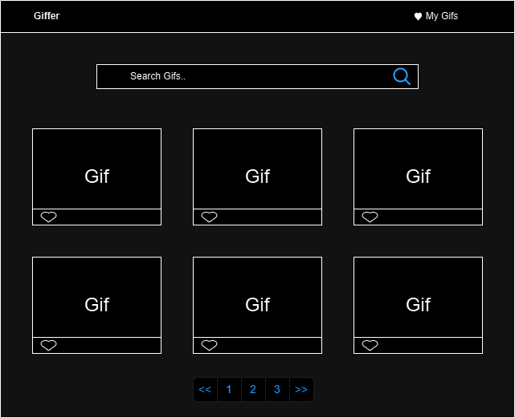

# Giffer

Giffer is a web application built with React, TypeScript, and Vite that allows users to search for and save GIFs from the Giphy API. The application features a responsive design and uses Material-UI for styling.

## Table of Contents

- [Giffer](#giffer)
  - [Table of Contents](#table-of-contents)
  - [Installation](#installation)
  - [Design](#design)
  - [Usage](#usage)
  - [Implementation Details](#implementation-details)
    - [Context API and `useReducer` for State Management](#context-api-and-usereducer-for-state-management)
    - [Local Storage for Saved GIFs](#local-storage-for-saved-gifs)
    - [Responsive Design with Material-UI](#responsive-design-with-material-ui)
    - [Error Handling and User Feedback](#error-handling-and-user-feedback)
    - [Pagination for Improved User Experience](#pagination-for-improved-user-experience)
    - [API Integration](#api-integration)
    - [Components](#components)
    - [Styling](#styling)
  - [Folder Structure](#folder-structure)

## Installation

To install and run the project locally, follow these steps:

1. Open the repository:
   ```sh
   cd Giffer
   ```

2. Install the dependencies:
   ```sh
   npm install
   ```

3. Create a `.env` file in the root directory and add your Giphy API key and base URL:
   ```env
   VITE_GIPHY_API_KEY=your_giphy_api_key
   VITE_GIPHY_BASE_URL=https://api.giphy.com/v1/gifs
   ```

4. Start the development server:
   ```sh
   npm run dev
   ```

## Design
A design of the application was drawn up to help guide the development process.
 

## Usage

The application is designed to provide a seamless user experience for searching and saving GIFs. The main features include:

- **Search Functionality**: Users can search for GIFs using the search bar. The search results are fetched from the Giphy API.
- **Pagination**: The application supports pagination to load more GIFs as the user navigates through the pages.
- **Saving GIFs**: Users can save their favorite GIFs by clicking on the heart icon. The saved GIFs are stored in the browser's local storage.
- **Responsive Design**: The application is responsive and works well on different screen sizes.

To use the application:
- Use the search bar to search for GIFs.
- Click on the heart icon to save a GIF.
- Navigate to the "My Saved GIFs" page to view your saved GIFs.
- Use the pagination buttons to load more GIFs.

## Implementation Details

### Context API and `useReducer` for State Management

Using the Context API and `useReducer` hook for state management allowed for a centralized and scalable state management solution. This approach made it easy to manage the state of GIFs, loading status, error messages, saved GIFs, and pagination details across the application.

### Local Storage for Saved GIFs

Storing saved GIFs in the browser's local storage ensures that users' favorite GIFs persist across sessions. This approach provides a simple and effective way to manage user preferences without the need for a backend.

### Responsive Design with Material-UI

Material-UI was chosen for its robust and customizable components. The use of the `sx` prop allowed for easy and flexible styling, ensuring that the application is responsive and visually appealing on different screen sizes.

### Error Handling and User Feedback

Implementing error handling and user feedback mechanisms, such as displaying error messages using the `Alert` component from Material-UI, ensures that users are informed of any issues that occur during the GIF fetching process.

### Pagination for Improved User Experience

Adding pagination to the application allows users to navigate through a large number of GIFs without overwhelming the interface. This approach improves the overall user experience by providing a structured way to browse GIFs.


### API Integration

The Giphy API is integrated using two functions: `fetchTrendingGifs` and `searchGifs`. These functions are defined in the `src/api/giphyApi.ts` file and are used to fetch trending GIFs and search for GIFs based on a query.

### Components

- **Navbar**: The navigation bar at the top of the application.
- **SearchBar**: The search bar component that allows users to search for GIFs.
- **GifferGrid**: The grid component that displays the list of GIFs.
- **Home**: The home page that displays the search bar and the grid of GIFs.
- **SavedGifs**: The page that displays the saved GIFs.

### Styling

The application uses Material-UI for styling. The theme is set to dark mode, and custom styles are applied using the `sx` prop.


## Folder Structure

```
Giffer/
  ├── .env
  ├── .gitignore
  ├── eslint.config.js
  ├── index.html
  ├── package.json
  ├── public/
  ├── README.md
  ├── src/
  │   ├── api/
  │   │   └── giphyApi.ts
  │   ├── App.css
  │   ├── App.tsx
  │   ├── assets/
  │   ├── components/
  │   │   ├── GifferGrid.tsx
  │   │   ├── Navbar.tsx
  │   │   └── SearchBar.tsx
  │   ├── context/
  │   │   └── GifferContext.tsx
  │   ├── index.css
  │   ├── main.tsx
  │   ├── pages/
  │   │   ├── Home.tsx
  │   │   └── SavedGifs.tsx
  │   ├── types/
  │   │   └── types.ts
  │   └── vite-env.d.ts
  ├── tsconfig.app.json
  ├── tsconfig.json
  ├── tsconfig.node.json
  └── vite.config.ts
```
